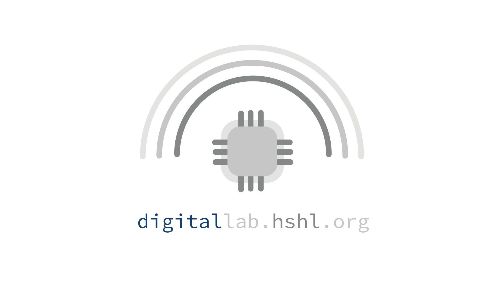
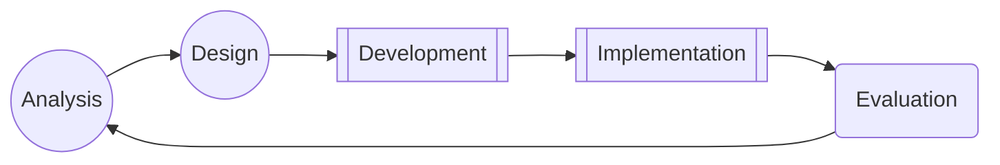

<p align="center">
  <a href="https://becklog.github.io/digitallab-hshl/">
    
  </a>
</p>

## About
We wanted to create a **hybrid-/remote-environment which enables remote flashing of microcontrollers** _(in our Case Arduino Uno/Mega)_ via a low-cost server _(Raspberry Pi 3)_, so that students can test standard sensors/actuators _(e.g. X40 sensor kit)_ along a self-paced learning-path.

The developed system can be installed and packed into a standardized Eurobox container, observed via camera, or used in an on-site / hybrid class concept, where the wiring and routing of the components is done to safe time in the labs.

## Table of Contents
- [Setup and Installation Guide](./installation-setup.md)
  <!--  - [_Alternative: RaspberryPi Image_]()-->
  - [Administration](./administration.md)
  - [Features](./features-use-cases.md)
  - [External Ressources](./features-use-cases.md)
- [Use Cases]()
- [Bill of Materials](./bill-of-materials-equipment-overview.md)
- [Wiring Diagrams](./docs/wiring_diagrams/wiring_diagrams.md)

## License
<div class="oer-cc-licensebox"><a href="https://creativecommons.org/licenses/by-sa/4.0/deed.de">
  </a><br>Weiternutzung als OER ausdrücklich erlaubt: Dieses Werk und dessen Inhalte sind - sofern nicht anders angegeben - lizenziert unter <a href="https://creativecommons.org/licenses/by-sa/4.0/deed.de" rel="license" target="_blank">CC BY-SA 4.0</a>. Nennung gemäß <a href="https://open-educational-resources.de/oer-tullu-regel/">TULLU-Regel</a> bitte wie folgt: <i><span xmlns:dct="http://purl.org/dc/terms/" property="dct:title">"<a href="https://github.com/becklog/digitallab-hshl" target="_blank" xmlns:cc="http://creativecommons.org/ns#" rel="cc:attributionURL">digiFellow digital remote lab</a>"</span> von <span xmlns:cc="http://creativecommons.org/ns#" property="cc:attributionName"><a href="www.hshl.de" target="_blank">Beck, Brodo, Quintanila-Docmac, Henkler, Rettberg, Rother</a></span>, Lizenz: <a href="https://creativecommons.org/licenses/by-sa/4.0/deed.de" target="_blank">CC BY-SA 4.0</a></i>.  </div>

Das Projekt wurde im Rahmen des [**Fellowships für Innovationen in der digitalen Hochschullehre (digi-Fellows)**](https://www.dh.nrw/kooperationen/Digi-Fellows-2) umgesetzt.

## Contributing
Yet the project has been internally hosted and underwent testing in small groups to ensure its reliability and functionality.
Should individuals wish to host the project independently and implement modifications, they are encouraged to do so in the form of **cloned repositories**. 

## Citation (Repository)
```bibtex
@misc{digifellow_digital_remote_lab,
  author = {Beck, Brodo and Quintanila-Docmac, Henkler and Retttberg, Rother},
  title = {digiFellow digital remote lab},
  year = {2022},
  publisher = {GitHub},
  journal = {GitHub repository},
  howpublished = {\url{https://github.com/becklog/digitallab-hshl/}},
}
```
## Publications
### INDIN 2023 Paper
- [C. Beck, L. Brodo, C. B. Q. Docmac, S. Henkler, A. Rettberg and K. Rother, "Introducing a group-based remote laboratory for embedded education," 2023 IEEE 21st International Conference on Industrial Informatics (INDIN), Lemgo, Germany, 2023, pp. 1-6](https://ieeexplore.ieee.org/document/10218010) [doi: 10.1109/INDIN51400.2023.10218010.](https://doi.org/10.1109/INDIN51400.2023.10218010)

```bibtex
@INPROCEEDINGS{10218010,
  author={Beck, Christopher and Brodo, Luca and Docmac, Camila Belen Quintanilla and Henkler, Stefan and Rettberg, Achim and Rother, Kristian},
  booktitle={2023 IEEE 21st International Conference on Industrial Informatics (INDIN)}, 
  title={Introducing a group-based remote laboratory for embedded education}, 
  year={2023},
  volume={},
  number={},
  pages={1-6},
  abstract={Teaching in the area of embedded systems is challenging because both software and hardware development must be considered in an integrated manner. The experience gained through the practical hardware-related implementation of prototypes cannot simply be replaced by simulations. The question is, however, how can students gain as much practical experience as possible while taking into account real laboratory constraints? We present an approach that allows students to gain practical experience via virtual access to laboratory setups, which allows them to work in groups remotely and then continue their work in the labs, providing a similar experience as under normal lab conditions. For educators, we introduce a flexible environment that can be adopted to specialized embedded courses due to the used components and methodology of the ADDIE teaching model.},
  keywords={Remote laboratories;Embedded systems;Education;Prototypes;Software;Hardware;Informatics;hybrid learning;remote laboratory;embedded systems education},
  doi={10.1109/INDIN51400.2023.10218010},
  ISSN={2378-363X},
  month={July},}
```
#### Abstract
Teaching in the area of embedded systems is challenging because both software and hardware development must be considered in an integrated manner. The experience gained through the practical hardware-related implementation of prototypes cannot simply be replaced by simulations. The question is, however, how can students gain as much practical experience as possible while taking into account real laboratory constraints? We present an approach that allows students to gain practical experience via virtual access to laboratory setups, which allows them to work in groups remotely and then continue their work in the labs, providing a similar experience as under normal lab conditions. For educators, we introduce a flexible environment that can be adopted to specialized embedded courses due to the used components and methodology of the ADDIE teaching model.

##### Addie Teaching Model

