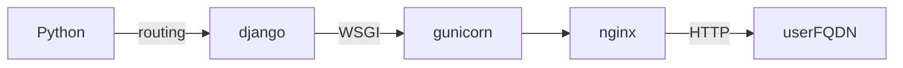
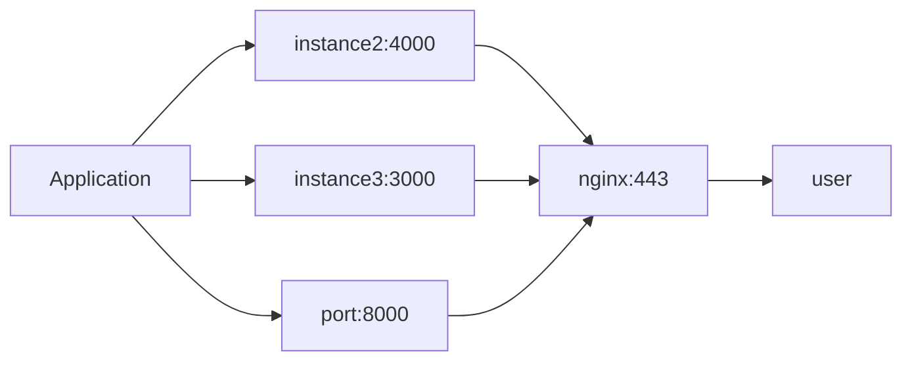

# IP Routing

### WSGI (Python) Web Server Gateway Interface
Interfacing Standard P333(3)

1. gunicorn is decoupleing the requests to the application, we could also switch to _flask_ for example, without changing the routes.
2. We are serving the application directly form the file structure on the machine running the application.

---
---
---

# Some thoughts on a scalable application

### NGINX

Let's assume we need to scale our application, and one instance is not working anymore. So we increase the instances on new ports.
For our users nginx solves that they can access it directly from their default browser settings (like :443 for SSL).
It is redirecting to the ports.

We could also serve different routes like /arduino on :3000 and another route for /esp :3000, then nginx could cache and serve the request faster without accessing the databases.

https://www.youtube.com/watch?v=WuH0T9FHDZ4
