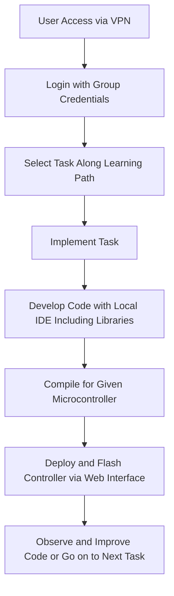

# Table of Contents --> Features
#### 1. User Interaction with Platform
#### TODO --> 2. Available Use Cases and Scenarios for Sensors/Actuators
#### TODO --> 3. Group based Access Concept (UML)

# 1. Learning Path for User Activities in Our Remote Lab

## 1. User Access via VPN

The initial step involves the user accessing the remote lab environment through a Virtual Private Network (VPN), ensuring a secure connection.

## 2. Login with Group Credentials

Once connected via VPN, users must authenticate themselves by logging in with their group credentials provided by the institution or lab administrator.

## 3. Select Task Along Learning Path

After successful login, users select a task from the learning path. Tasks are designed to progressively increase in complexity and are aligned with the learning objectives.

## 4. Implement Task

Users implement the selected task. This involves understanding the task requirements and starting the process of coding and development.

## 5. Develop Code with Local IDE Including Libraries

The development process continues with users writing code using their local Integrated Development Environment (IDE). They include necessary libraries that are required for the task at hand.

## 6. Compile for Given Microcontroller

Once the code is developed, users compile it for the specific microcontroller they are working with. This step checks for errors and prepares the code for deployment.

## 7. Deploy and Flash Controller via Web Interface

After compiling, the code is deployed and flashed onto the microcontroller through a web interface provided by the remote lab. This step uploads the code to the microcontroller.

## 8. Observe and Improve Code or Go on to Next Task

Finally, users observe the behavior of their code on the microcontroller. Based on observations, they can make improvements and debug, or if the task is completed successfully, move on to the next task in the learning path.
