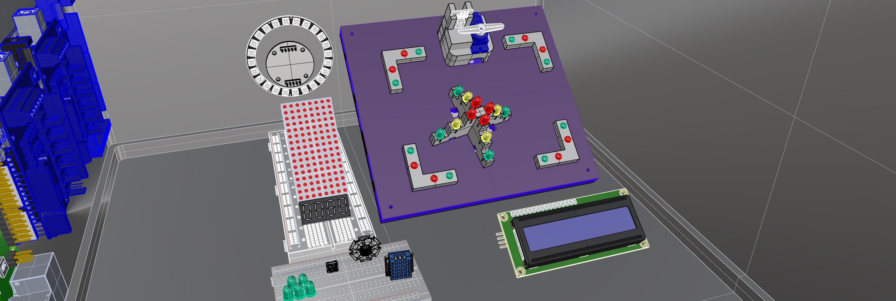

# Learning Path Stages based on Previous Knowledge

| Stage         | Goals                                         | Example                                  | `.ino` Example in GitHub Repo                                               |
|---------------|-----------------------------------------------|------------------------------------------|----------------------------------------------------------------------------|
| **Beginner**  | Concept of time                               | `delay()`, `millis()`                    | [/arduino-examples/time_management.ino](#)                                 |
|               | Concept of PWM                                | LEDs, RGB-LEDs                           | [/arduino-examples/rgb_led_pwm.ino](#)                                     |
|               | Analog inputs                                 | `analogRead()`                           | [/arduino-examples/analog_sensor_reading.ino](#)                           |
|               | Digital I/O                                   | `digitalRead()`, `digitalWrite()`        | [/arduino-examples/digital_io.ino](#)                                      |
|               | Basic use of delay()                          | Simple LED blink                         | [/arduino-examples/simple_led_blink.ino](#)                                |
| **Intermediate** | Using C-Libraries                          | Displays                                 | [/arduino-examples/lcd_display_i2c.ino](#)                                 |
|               | Multiplexing                                  | 8x8 LEDs                                 | [/arduino-examples/led_matrix_8x8.ino](#)                                  |
|               | Voltage measurement                           | Power LED                                | [/arduino-examples/voltage_measurement.ino](#)                             |
|               | Control motors                                | Servo, stepper                           | [/arduino-examples/servo_motor_control.ino](#)                             |
|               | Read / debounce buttons                       | With servo trigger                       | [/arduino-examples/button_debounce.ino](#)                                 |
|               | Introduction to timers and interrupts         | `millis()` for non-blocking code, `attachInterrupt()` | [/arduino-examples/timers_and_interrupts.ino](#)                        |
|               | Basic data storage concepts                   | EEPROM read/write                        | [/arduino-examples/eeprom_data_storage.ino](#)                             |
| **Advanced**  | Machine to machine communication              | Bus or network                           | [/arduino-examples/m2m_communication.ino](#)                               |
|               | IoT Protocols                                 | TCP/IP, UDP                              | [/arduino-examples/iot_protocols.ino](#)                                   |
|               | RESTful messages                              | MQTT, HTTP, OSC                          | [/arduino-examples/restful_messages.ino](#)                                |
|               | Traffic intersection                          | Use Case with Multi-LEDs                 | [/arduino-examples/traffic_intersection_simulation.ino](#)               |
|               | Advanced timers and interrupts                | Using Timer libraries for complex scheduling | [/arduino-examples/advanced_timers.ino](#)                              |
|               | Multi-threading and task scheduling           | FreeRTOS on Arduino                      | [/arduino-examples/multithreading_freertos.ino](#)                         |
|               | Advanced storage concepts and allocation      | Using SD cards for data logging, Dynamic memory allocation | [/arduino-examples/sd_card_logging.ino](#)                          |
|               | When to use and avoid delay()                 | Understanding delay() vs non-blocking code design | [/arduino-examples/delay_vs_non_blocking.ino](#)                       |

# Scenario Driven Coding Class
## Intersection Scenario

  

## Color Sensor

# Component Based Coding Class
### Additional Interesting Sensors and Modules for Future Projects

| Sensor/Module Type                                          | Potential Use Case                                             | `.ino` Example in GitHub Repo                                           |
|-------------------------------------------------------------|----------------------------------------------------------------|------------------------------------------------------------------------|
| JoyIt X40 Sensor Kit                                        | Comprehensive sensor experiments                               | [/docs/examples/joyit_x40_kit_experiments.ino](#)                      |
| SMD-LED                                                     | High-density LED displays                                      | [/docs/examples/smd_led_display.ino](#)                                |
| DHT11 Temperature and Humidity Sensor                       | Environmental monitoring system                                | [/docs/examples/dht11_monitoring_system.ino](#)                        |
| Photoresistor                                               | Light-sensitive applications, such as automatic night lights   | [/docs/examples/photoresistor_light_control.ino](#)                    |
| HC-04 Ultrasonic Sensor                                     | Distance measuring or obstacle avoidance robots                 | [/docs/examples/hc04_distance_measurement.ino](#)                      |
| Neopixel LED Ring                                           | Decorative lighting or status indicators                        | [/docs/examples/neopixel_led_ring.ino](#)                              |
| Button                                                      | User input for interactive projects                            | [/docs/examples/button_user_input.ino](#)                              |
| SG90 Servo Motors                                           | Precise control in robotic arms or mechanisms                   | [/docs/examples/sg90_servo_control.ino](#)                             |
| 7 segment display                                           | Numeric output display for counters or clocks                   | [/docs/examples/7_segment_display.ino](#)                              |
| 8x8 LED Matrix                                              | Scrolling text display or simple animations                     | [/docs/examples/led_matrix_8x8_animation.ino](#)                       |
| LCD Display via I2C                                         | User interfaces for projects with informational output          | [/docs/examples/lcd_i2c_user_interface.ino](#)                         |
| **Rapid Prototyped Modules**                                |                                                                |                                                                        |
| Traffic Intersection Simulation with traffic light pyramid  | Educational model for traffic light control system              | [/docs/examples/traffic_light_control.ino](#)                          |
| Remote button actuator with 3D printed holder               | Remote-controlled mechanisms for smart devices                  | [/docs/examples/remote_button_actuator.ino](#)                         |
| 3D printed holder for RaspberryPi HQ Cam with Neopixel Ring | Enhanced photography lighting control system                    | [/docs/examples/raspberrypi_cam_lighting_control.ino](#)               |

